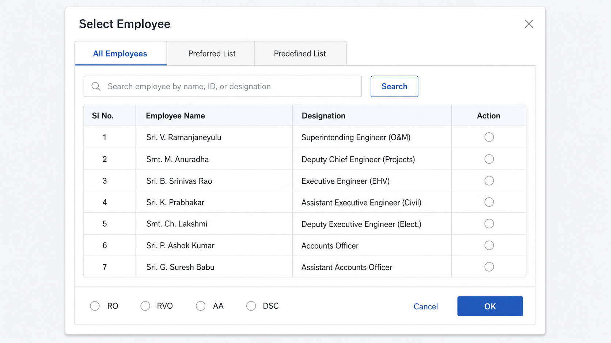

# EmployeeForwardSelector

A reusable, framework-agnostic JavaScript popup plugin for selecting an employee and an action type before forwarding a file, application, approval, or workflow item.

It works as a standalone modal that can be dropped into any application — React, Angular, Vue, plain HTML/JavaScript, or any server-rendered stack (Node.js, PHP/Laravel, Python/Django, Java/Spring Boot, etc.). The plugin only handles the UI selection step; the host application supplies the employee search function and handles the returned selection.



## Features

- Three selection tabs: **All Employees** (search-driven), **Preferred List**, and **Predefined List**
- Heart toggle in **All Employees** to add/remove an employee from the Preferred List without leaving the search results
- One employee selection enforced globally across all tabs
- Action-type selection: `RO`, `RVO`, `AA`, `DSC` (configurable)
- Validation messages, loading/empty/error states
- Keyboard accessible: focus trap, Escape-to-close, ARIA roles, visible focus states
- Ships its own scoped CSS (`efs-` prefixed classes) — no dependencies, no build step
- Single file, works as a plain `<script>` global or via `import`/`require` in bundler-based apps

## Quick Start

```html
<div id="employee-selector-root"></div>

<script src="employee-forward-selector.js"></script>
<script>
  EmployeeForwardSelector.init({
    container: "#employee-selector-root",
    title: "Select Employee",
    preferredEmployees: [
      { employeeId: "EMP101", employeeName: "Employee One", designation: "Assistant Engineer" }
    ],
    predefinedEmployees: [
      { employeeId: "EMP201", employeeName: "Employee Two", designation: "Divisional Engineer" }
    ],
    searchEmployees: async function (searchText) {
      // Replace with a real API call
      return [
        { employeeId: "EMP001", employeeName: "Employee Name", designation: "Designation" }
      ];
    },
    onConfirm: function (data) {
      console.log("Selected employee and action:", data);
    },
    onCancel: function () {
      console.log("Employee selection cancelled");
    }
  });

  document.getElementById("forwardBtn").addEventListener("click", function () {
    EmployeeForwardSelector.open();
  });
</script>
```

See [examples/plain-html.html](examples/plain-html.html) for a full working page, and [examples/react-example.jsx](examples/react-example.jsx) for a React integration using `useRef`/`useEffect`.

### Running the plain HTML example against a real backend

`examples/plain-html.html` calls `/api/employees` (same origin) instead of a mock, so it needs the bundled dev proxy ([server.js](server.js)) to be running:

```bash
cp .env.example .env       # fill in EFS_API_USERNAME / EFS_API_PASSWORD
npm install
npm start
```

Then open `http://localhost:3001/examples/plain-html.html` (not as a `file://` path). The proxy serves the static example files and forwards employee search calls to the configured API with Basic Auth attached server-side, so credentials never reach the browser and no CORS configuration is needed on the client. See the comments in [server.js](server.js) for adjusting the request/response contract to match your real backend.

## API

```javascript
EmployeeForwardSelector.init(config)
EmployeeForwardSelector.open()
EmployeeForwardSelector.close()
EmployeeForwardSelector.destroy()
EmployeeForwardSelector.setPreferredEmployees(data)
EmployeeForwardSelector.setPredefinedEmployees(data)
EmployeeForwardSelector.setFilterOptions({ functionalHeads: string[], services: string[] })
```

## Configuration

| Option | Type | Default | Description |
| --- | --- | --- | --- |
| `container` | `string \| Element` | — (required) | CSS selector or DOM element to mount the popup into |
| `title` | `string` | `"Select Employee"` | Modal title |
| `subtitle` | `string` | `"Choose an employee and assign the forwarding action"` | Optional modal subtitle |
| `preferredEmployees` | `Employee[]` | `[]` | Data for the Preferred List tab |
| `predefinedEmployees` | `Employee[]` | `[]` | Data for the Predefined List tab |
| `searchEmployees` | `(searchText: string, filters: { functionalHead: string, service: string }) => Promise<Employee[]>` | — (required for All Employees tab) | Called on tab open, on Search click, and (debounced) while typing for suggestions. `filters` holds the current dropdown selections (empty string = "All") |
| `functionalHeadOptions` | `string[]` | `[]` | Options for the Functional Head filter dropdown |
| `serviceOptions` | `string[]` | `[]` | Options for the Services filter dropdown |
| `suggestMinChars` | `number` | `2` | Minimum characters typed before typeahead suggestions are fetched |
| `suggestDebounceMs` | `number` | `250` | Debounce delay before firing the typeahead `searchEmployees` call |
| `onConfirm` | `(data) => void` | — (required) | Called with the selection when OK is clicked |
| `onCancel` | `() => void` | `() => {}` | Called when the popup is closed without a selection |
| `onPreferredListChange` | `(updatedList: Employee[], employee: Employee, isAdded: boolean) => void` | `() => {}` | Called when the heart toggle in All Employees adds/removes an employee from the Preferred List, so the host app can persist the change |
| `defaultActiveTab` | `"allEmployees" \| "preferredList" \| "predefinedList"` | `"allEmployees"` | Tab shown on open |
| `actionTypes` | `string[]` | `["RO", "RVO", "AA", "DSC"]` | Action-type radio options |
| `allowOutsideClickClose` | `boolean` | `false` | Close the popup on backdrop click |
| `resetSelectionOnClose` | `boolean` | `true` | Clear the selection after each close |
| `closeOnEscape` | `boolean` | `true` | Allow the Escape key to close the popup |

### Employee data format

```json
{
  "employeeId": "EMP001",
  "employeeName": "Employee Name",
  "designation": "Designation"
}
```

Optional fields (e.g. `department`, `office`, `mobile`, `email`, `positionId`) may also be included; only `employeeName` and `designation` are shown in the table today, but any extra field on the employee object is preserved and passed through to `onConfirm` untouched.

## Output

On **OK**, `onConfirm` receives the full selected employee object (plus `sourceTab`) exactly as it was passed into the plugin, for example:

```json
{
  "selectedEmployee": {
    "employeeId": "EMP001",
    "employeeName": "Shaik Khaja Mynuddin",
    "designation": "Junior Accounts Officer",
    "positionId": 30000601,
    "sourceTab": "allEmployees"
  },
  "actionType": "RO"
}
```

On **Cancel** (or Escape / close button / outside click, if enabled), `onCancel` is called and no data is returned.

## Project Files

- [employee-forward-selector.js](employee-forward-selector.js) — the plugin
- [employee-forward-selector.css](employee-forward-selector.css) — standalone stylesheet (same rules the JS self-injects)
- [examples/](examples/) — plain HTML/JS and React usage examples, plus shared mock data
- [Prompt.md](Prompt.md) — the original functional specification this plugin was built against

## Security Notes

- The plugin does not handle authentication or call any fixed backend API — the host app supplies `searchEmployees`.
- All employee-supplied text is rendered via `textContent`, never `innerHTML`, to prevent XSS.
- No employee data is persisted beyond the popup's runtime.
